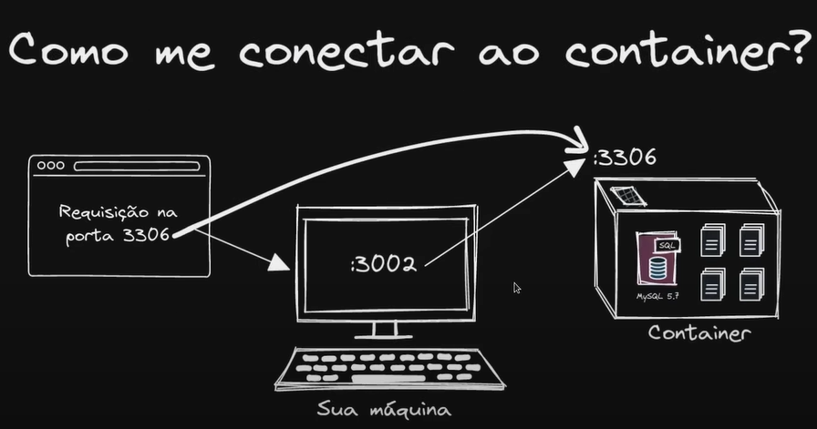

# Docker Básico

Um tutorial básico para quem nunca usou Docker na vida e também para aqueles que precisam de uma colinha.

## Primeiros passos: 
    - Instalar o Docker na sua máquina no site Docker Docs
    - Para windows e mac, existe o Dokcer Desktop

## Criando containers:
    - Acessar o Docker Hub para baixar todas as imagens que necessita

    - Utilize o comando: 
    docker run --name nome_do_seu_container -e YOURDBNAME_PASSWORD=password -p 0000:0000 -d dbname:15.0
    
## Explicando os porquês:
A flag opcional `--name nome_do_seu_container` indicará o nome do container que você está criando

Algumas imagens precisam da criação de uma variavel de ambiente para definir a senha, como Postgres e Mysql. Para esses casos é adicionado a flag `-e` para indicar isso e logo após o nome da variavel que armazenará a senha. É importante seguir o padrão de nomeclatura contido no Docker Hub, caso contrário a sua conexão não funcionará.

Você precisa definir em qual porta essa conexão irá se comunicar, a primeira é a da sua máquina e a segunda a do container `0000:0000`. Existem padrões, como o do Postgres que é 5432. Como exemplo, ficaria: `5432:5432`.

A flag `-d` representa que esse container irá subir em segundo plano, assim não travará o seu terminal.

Por fim, o nome do imagem que você deseja usar (no exemplo foi de um banco de dados) e opcionalmente a versão dele.

## Comandos básicos:
Para Listar os containers: `docker ps`
- Se adicionar a flag `-a` ao fim, poderá ver os containers que foram parados também

Para parar um container: `docker stop id`

Para reativar um container: `docker start id`

Para remover/excluir um container: `docker rm id`
- Não é necessário inserir o id completo, basta os primeiros 2 digitos

## Criar conexões com bancos:
É necessário fazer uma ligação entre a porta da nossa máquina com a porta do container

    
    
#### Links úteis:
- [Docker Hub](https://hub.docker.com/)
- [Docker Docs](https://docs.docker.com/engine/install/)

#### Erros comnuns:
* Antes de excluir um container, pare-o antes

#### Contatos: 
[Linkedin](https://www.linkedin.com/in/alessandra-fernandes-contato/)